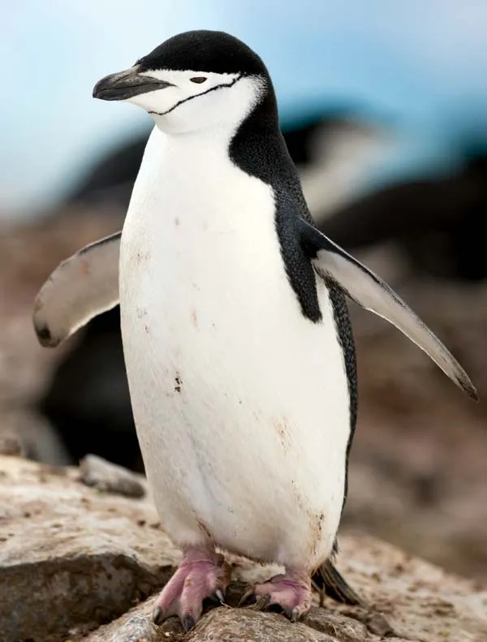

```{r echo=FALSE, include=FALSE}
library(palmerpenguins)
df=penguins_raw
library(effsize)

```


```{r echo=FALSE, include=FALSE}
#Subsetting the penguin Species 
head(penguins)
df=penguins_raw
adelieset <- df[df$Species == "Adelie Penguin (Pygoscelis adeliae)", ]
adeliemale =adelieset[adelieset$Sex == "MALE",]
adeliefemale = adelieset[adelieset$Sex =="FEMALE",]

gentooset=df[df$Species =="Gentoo penguin (Pygoscelis papua)",]
gentoomale = gentooset[gentooset$Sex =="MALE",]
gentoofemale = gentooset[gentooset$Sex =="FEMALE",]

#Important to take arithmetic mean 
meanbodymassadelie=mean(adelieset$"Body Mass (g)", na.rm=TRUE)
meanbodymassadeliemale=mean(adeliemale$"Body Mass (g)", na.rm=TRUE)
meanbodymassadeliefemale=mean(adeliefemale$"Body Mass (g)", na.rm=TRUE)
medianbodymassadeliemale=median(adeliemale$"Body Mass (g)", na.rm=TRUE)
medianbodymassadeliefemale=median(adeliefemale$"Body Mass (g)", na.rm=TRUE)

summaryadeliefemale=summary(adeliefemale[,3:6])
summaryadeliemale=summary(adeliemale[,3:6])

```


# abstract (short summary)


# Introduction

In the intricate web of the natural world, the phenomenon of sexual dimorphism stands out as a captivating manifestation of evolutionary diversity. Just like in the species homo sapiens, the animal kingdom showcases a myriad of fascinating adaptations that highlight the distinct physical and behavioral differences between males and females of the same species. Sexual dimorphism, rooted in the forces of natural selection and reproductive strategies, offers a window into the adaptive mechanisms that have shaped countless species over millennia.  

From the majestic mane of a male lion to the vibrant plumage of a male peacock, sexual dimorphism is often prominently displayed in the external characteristics of animals. This manifests as differences in size, coloration, behavior, or reproductive anatomy between the sexes of a species. Beyond mere aesthetics, these differences often serve crucial roles in the survival and reproductive success of individuals within a species. A fundamental understanding of the various forms of sexual dimorphism in a variety of species will be an important step toward understanding the evolutionary pressures that have shaped these unique traits and behaviors.

This report is dedicated to the comprehensive examination of sexual dimorphism in the context of penguins, and highlight the ecological and reproductive significance of these differences. By undertaking this investigation, we endeavor to acquire a deeper understanding of the intricate dynamics between males and females within various species, elucidating how evolutionary pressures have contributed to the development of these distinctive relationships.

In Chinstrap penguins (Pygoscelis antarcticus), one of the most recognizable and widely studied penguin species, sexual dimorphism manifests notably in aspects such as body mass, flipper length, and bill size. This report aims to explore and quantify the differences between male and female Chinstrap penguins, shedding light on how these disparities play a crucial role in their breeding behavior, survival strategies, and overall ecology.

Chinstrap penguins, known for their distinctive black band under their heads, inhabit several islands and shores in the Southern Pacific and the Antarctic Ocean. These regions' harsh and competitive environments necessitate various adaptations, potentially influencing the development of sexual dimorphism. Previous studies have indicated that differences in body size and features between males and females could be attributed to factors like mating competition, foraging efficiency, and parental roles in nurturing the young. 


<br>

{width=35%}

# Data
The data employed to substantiate the previously posited hypothesis was sourced from the Palmerpenguins package of the CRAN R library. This package encapsulates an extensive dataset named penguins_raw featuring dimensions such as body mass, size measurements, clutch observations, and blood isotope ratios for adult Adélie, Chinstrap, and Gentoo penguins in the Palmer Archipelago near Palmer Station, Antarctica. Dr. Kristen Gorman and the Palmer Station Long Term Ecological Research (LTER) Program curated and generously shared this dataset, showcasing the collaborative nature of scientific endeavors. Spanning 344 penguins across three distinct species (Adélie, Chinstrap, and Gentoo ), the dataset originates from three islands within the Palmer Archipelago, providing a rich tapestry of geographical diversity. Notably, the dataset includes morphological measurements, with culmen (bill) length and depth thoughtfully renamed as bill_length_mm and bill_depth_mm for clarity, contributing to a nuanced comprehension of penguin ecology. Complementing the morphological data are clutch observations shedding light on the reproductive behavior of the penguins and blood isotope ratios offering insights into their dietary habits and foraging strategies. Furthermore the dataset extends to other sample information such as individual ID of the observed penguin, the sample number, the study name and some comments. Since were interested in performing a descriptive analysis and use the information to abstract and generalize, we simply ignore those datapoints and focus on the described relevant ones.

In the pursuit of substantiating the stated hypothesis, our focus is on comparing key characteristics such as bill/culmen length and depth, body mass, delta 13C, delta 15N, and flipper size between male and female penguins. The objective is to discern potential sexual dimorphism and its implications in the context of the penguin species under study. Moreover, we intend to extend our analysis by comparing the obtained results with a dataset concerning possums in Australia and potentially other species. This comparative approach aims to abstract the underlying hypothesis and draw inferences that transcend the confines of the penguin dataset, contributing to a broader understanding of sexual dimorphism and ecological dynamics across diverse species. In our exploration of the palmerpenguins dataset, we focused on pertinent dimensions to substantiate our hypothesis, selectively disregarding columns not integral to our investigation. 
Below one can see the head of the penguins_raw dataframe.
```{r echo=FALSE}
pengraw=head(df)
knitr::kable(pengraw)
```


# Statistical analysis

## Data preparation

#OLD#
To extract crucial insights from the penguins dataset and pursue our primary objective, which is to emphasize our hypothesis that there are distinctive physical characteristics between male and female penguins, we employ built-in R utilities and leverage specific functionalities offered by the "effsize" package accessible through the CRAN repository. All computations and tests are executed within the R Markdown environment. This approach allows us to thoroughly analyze the dataset, assess sex-based variations, and validate our underlying hypothesis with a comprehensive set of statistical tools.

To accomplish this, certain key steps must be taken:
The dataset needs preparation, requiring a split into the two sexes to facilitate individual comparisons.
#OLD#

#NEW#
Statistical analyses were performed using R (version 4.3.1). Our primary objective is to emphasize our hypothesis - highlighting the significant sexual dimorphism with the Chinstrap penguins within our datasets. We compared morphological measurements (Body mass, Bill length, Bill depth, and Flipper length) between male and female penguins using various statistical approaches and tests to further buttress our hypothesis. Firstly, since our dataset was from the Palmerpenguins library containing 3 (three) different penguin species (Adelie, Chinstrap, and Gentoo), it was imperative to isolate the datasets for only the Chinstrap penguins since that is our focus for this report and to then further analyze the data.

See below the distribution of sexes within the Palmerpenguins dataset:

```{r echo=FALSE}
knitr::kable(table(df$Sex,df$Species))
```


Given our specific focus on the Chinstrap species within the Palmer penguins package, it is imperative to create subsets corresponding to each penguin species within the general dataset. While we currently require this subset specifically for the Chinstrap species, anticipating potential use for the other subsets later in this report prompts us to perform this subsetting procedure for all penguin species at this stage. By doing so, we ensure that the necessary datasets are readily available for subsequent analyses and facilitate a smoother progression in the later stages of our report.

###

Upon isolation of the Chinstrap datasets into a data frame, we went ahead to perform the Shapiro-wilke’s test to check if the datasets were gotten from a normal distribution, and then since the test confirmed that the data were from a normal distribution, we went ahead to perform the t.test and manova (multivariate analysis) for each of the morphological characteristics we are working with. The t.test return values including the p-value which indicates the degree or significance of differences between the sexes. Next, we conducted the effect size using the cohen’s W.
#NEW#

```{r echo=FALSE}
chinstrapset=df[df$Species =="Chinstrap penguin (Pygoscelis antarctica)",]
adelieset = df[df$Species == "Adelie Penguin (Pygoscelis adeliae)", ]
gentooset=df[df$Species =="Gentoo penguin (Pygoscelis papua)",]
```


```{r echo=FALSE}
# Subsetting Chinstrap penguin set by sexes


chinstrapmale=chinstrapset[chinstrapset$Sex =="MALE",]
chinstrapfemale=chinstrapset[chinstrapset$Sex =="FEMALE",]

#Summary of all the columns of the individual subsets 
summarychinstrapfemale=summary(chinstrapfemale[,3:6])
summarychinstrapmale=summary(chinstrapmale[,3:6])

meanbodymasschinstrap=mean(chinstrapset$"Body Mass (g)", na.rm=TRUE)
meanbilllengthchinstrap=mean(chinstrapset$"Culmen Length (mm)", na.rm=TRUE)
meanbilldepthchinstrap=mean(chinstrapset$"Culmen Depth (mm)", na.rm=TRUE)
meanflipperlengthchinstrap=mean(chinstrapset$"Flipper Length (mm)", na.rm=TRUE)
```

## Numeric parameters

In the following section, a series of statistical analyses were undertaken to investigate sexual dimorphism in chinstrap penguins. These analyses encompassed the computation of various statistical parameters for bill length and depth, body mass, and flipper length. Parameters such as means, medians, and comprehensive summaries were derived, and these will be subsequently utilized in additional statistical analyses or tests. The interpretation of these parameters, along with measured values, will be presented in the results section, contributing to our understanding of sexual dimorphism in chinstrap penguins.

```{r label = calculating.mean.and.median, echo=FALSE,results='hide'}
### Mean Chinstrap population

meanbodymasschinstrap=mean(chinstrapset$"Body Mass (g)", na.rm=TRUE)
meanbilllengthchinstrap=mean(chinstrapset$"Culmen Length (mm)", na.rm=TRUE)
meanbilldepthchinstrap=mean(chinstrapset$"Culmen Depth (mm)", na.rm=TRUE)
meanflipperlengthchinstrap=mean(chinstrapset$"Flipper Length (mm)", na.rm=TRUE)


### Median Chinstrap population

medianbodymasschinstrap=median(chinstrapset$"Body Mass (g)", na.rm=TRUE)
medianbilllengthchinstrap=median(chinstrapset$"Culmen Length (mm)", na.rm=TRUE)
medianbilldepthchinstrap=median(chinstrapset$"Culmen Depth (mm)", na.rm=TRUE)
medianflipperlengthchinstrap=median(chinstrapset$"Flipper Length (mm)", na.rm=TRUE)


### Male

#### Standard deviation

#bill length
male_std_dev_bill_Length <- sd(chinstrapmale$"Culmen Length (mm)")
male_std_dev_bill_Length
#bill depth 
male_std_dev_bill_depth <- sd(chinstrapmale$"Culmen Depth (mm)")
male_std_dev_bill_depth
#flipper length
male_std_dev_flipper_Length <- sd(chinstrapmale$"Flipper Length (mm)")
male_std_dev_flipper_Length
#bodymass
male_std_dev_body_mass <- sd(chinstrapmale$"Body Mass (g)")
male_std_dev_body_mass


#### Mean

#body mass
meanbodymasschinstrapmale=mean(chinstrapmale$"Body Mass (g)", na.rm=TRUE)
#bill lenght
meanbilllengthchinstrapmale=mean(chinstrapmale$"Culmen Length (mm)", na.rm=TRUE)
#bill depth 
meanbilldepthchinstrapmale=mean(chinstrapmale$"Culmen Depth (mm)", na.rm=TRUE)
#flipper length 
meanflipperlengthchinstrapmale=mean(chinstrapmale$"Flipper Length (mm)", na.rm=TRUE)

#### Median

#body mass
medianbodymasschinstrapmale=median(chinstrapmale$"Body Mass (g)", na.rm=TRUE)
#bill length 
medianbilllengthchinstrapmale=median(chinstrapmale$"Culmen Length (mm)", na.rm=TRUE)
#bill depth
medianbilldepthchinstrapmale=median(chinstrapmale$"Culmen Depth (mm)", na.rm=TRUE)
#flipper length 
medianflipperlengthchinstrapmale=median(chinstrapmale$"Flipper Length (mm)", na.rm=TRUE)


### Female

#### Standard deviation

#bill length
female_std_dev_bill_Length <- sd(chinstrapfemale$"Culmen Length (mm)")
female_std_dev_bill_Length
#bill depth
female_std_dev_bill_depth <- sd(chinstrapfemale$"Culmen Depth (mm)")
female_std_dev_bill_depth
#flipper length
female_std_dev_flipper_Length <- sd(chinstrapfemale$"Flipper Length (mm)")
female_std_dev_flipper_Length
#body mass
female_std_dev_body_mass <- sd(chinstrapfemale$"Body Mass (g)")
female_std_dev_body_mass


#### Mean 

#body mass
meanbodymasschinstrapfemale=mean(chinstrapfemale$"Body Mass (g)", na.rm=TRUE)
#bill length 
meanbilllengthchinstrapfemale=mean(chinstrapfemale$"Culmen Length (mm)", na.rm=TRUE)
#bill depth 
meanbilldepthchinstrapfemale=mean(chinstrapfemale$"Culmen Depth (mm)", na.rm=TRUE)
#flipper length 
meanflipperlengthchinstrapfemale=mean(chinstrapfemale$"Flipper Length (mm)", na.rm=TRUE)


#### Median

#body mass
medianbodymasschinstrapfemale=median(chinstrapfemale$"Body Mass (g)", na.rm=TRUE)
#bill length 
medianbilllengthchinstrapfemale=median(chinstrapfemale$"Culmen Length (mm)", na.rm=TRUE)
#billl depth 
medianbilldepthchinstrapfemale=median(chinstrapfemale$"Culmen Depth (mm)", na.rm=TRUE)
#flipper length 
medianflipperlengthchinstrapfemale=median(chinstrapfemale$"Flipper Length (mm)", na.rm=TRUE)
```


## Statistical tests

### Shapiro-wilke test


To assess the normality of our datasets, we employed the Shapiro-Wilk test, a statistical method used to evaluate whether a given variable follows a normal distribution. This test is particularly sensitive to deviations from normality in small to moderately sized samples.

The Shapiro-Wilk test statistic (\(W\)) is given by:

\[ W = \frac{\left(\sum_{i=1}^{n} a_i x_{(i)}\right)^2}{\sum_{i=1}^{n} (x_i - \bar{x})^2} \]

where \(n\) is the sample size, \(x_{(i)}\) is the \(i\)-th ordered observation, \(\bar{x}\) is the sample mean, and \(a_i\) are constants dependent on the sample size and the covariance matrix of the ordered sample values.


For each relevant variable, we conducted a Shapiro-Wilk test, where the null hypothesis (H0) posits that the data is normally distributed. Conversely, the alternative hypothesis (H1) suggests that the data significantly deviates from a normal distribution.

In the context of our analysis, meeting the assumption of normality is crucial, especially when considering subsequent two-sample t-tests. Because we are focusing on sexual dimorphism in chinstrap penguins, this test and subsequent two-sample t-tests were applied only to the relevant variables in chinstrap.

```{r label = shapiro-wilke-test,echo=FALSE,results='hide'}
a_bill_length_female = shapiro.test(na.omit(adeliefemale$"Culmen Length (mm)"))$p.value
a_bill_length_male = shapiro.test(na.omit(adeliemale$"Culmen Length (mm)"))$p.value

a_bill_depth_female = shapiro.test(na.omit(adeliefemale$"Culmen Depth (mm)"))$p.value
a_bill_depth_male_fit = adeliemale$"Culmen Depth (mm)"[adeliemale$"Culmen Depth (mm)"<21.2]
a_bill_depth_male = shapiro.test(na.omit(a_bill_depth_male_fit))$p.value

a_flipper_length_female = shapiro.test(na.omit(adeliefemale$"Flipper Length (mm)"))$p.value
a_flipper_length_male = shapiro.test(adeliemale$"Flipper Length (mm)")$p.value

a_body_mass_female = shapiro.test(na.omit(adeliefemale$"Body Mass (g)"))$p.value
a_body_mass_male = shapiro.test(na.omit(adeliemale$"Body Mass (g)"))$p.value


adelishapiro = data.frame(a_bill_length_female,a_bill_length_male,a_bill_depth_female,a_bill_depth_male, a_flipper_length_female,a_flipper_length_male,a_body_mass_female,a_body_mass_male)

adelishapiro>0.05

g_bill_length_female = shapiro.test(na.omit(gentoofemale$"Culmen Length (mm)"))$p.value
g_bill_length_male_fit = gentoomale$"Culmen Length (mm)"[gentoomale$"Culmen Length (mm)"<59]
g_bill_length_male = shapiro.test(na.omit(g_bill_length_male_fit))$p.value

g_bill_depth_female = shapiro.test(na.omit(gentoofemale$"Culmen Depth (mm)"))$p.value
g_bill_depth_male = shapiro.test(na.omit(gentoomale$"Culmen Depth (mm)"))$p.value

g_flipper_length_female = shapiro.test(na.omit(gentoofemale$"Flipper Length (mm)"))$p.value
g_flipper_length_male = shapiro.test(na.omit(gentoomale$"Flipper Length (mm)"))$p.value

g_body_mass_female = shapiro.test(na.omit(gentoofemale$"Body Mass (g)"))$p.value
g_body_mass_male = shapiro.test(na.omit(gentoomale$"Body Mass (g)"))$p.value


gentooshapiro = data.frame(g_bill_length_female,g_bill_length_male,g_bill_depth_female,g_bill_depth_male, g_flipper_length_female,g_flipper_length_male,g_body_mass_female,g_body_mass_male)

gentooshapiro>0.05
```

```{r label = chinstrap.shapiro, echo=FALSE}
c_bill_length_female_fit = chinstrapfemale$"Culmen Length (mm)"[chinstrapfemale$"Culmen Length (mm)"<58]
c_bill_length_female = shapiro.test(na.omit(c_bill_length_female_fit))$p.value
c_bill_length_male = shapiro.test(na.omit(chinstrapmale$"Culmen Length (mm)"))$p.value

c_bill_depth_female = shapiro.test(na.omit(chinstrapfemale$"Culmen Depth (mm)"))$p.value
c_bill_depth_male = shapiro.test(na.omit(chinstrapmale$"Culmen Depth (mm)"))$p.value

c_flipper_length_female = shapiro.test(na.omit(chinstrapfemale$"Flipper Length (mm)"))$p.value
c_flipper_length_male = shapiro.test(na.omit(chinstrapmale$"Flipper Length (mm)"))$p.value

c_body_mass_female = shapiro.test(na.omit(chinstrapfemale$"Body Mass (g)"))$p.value
c_body_mass_male = shapiro.test(na.omit(chinstrapmale$"Body Mass (g)"))$p.value


chinshapiromale <- data.frame(
  bill_length = c_bill_length_male,
  bill_depth = c_bill_depth_male,
  flipper_length = c_flipper_length_male,
  body_mass = c_body_mass_male
)

chinshapirofemale <- data.frame(
  bill_length = c_bill_length_female,
  bill_depth = c_bill_depth_female,
  flipper_length = c_flipper_length_female,
  body_mass = c_body_mass_female
)

chinshapiro <- rbind(chinshapiromale, chinshapirofemale)
chinshapiro=rbind(chinshapiromale,chinshapirofemale)
```
To meet the assumption of normal distribution, we identified and removed a outlier from bill length of female chinstrap penguins dataset. This step was taken to enhance the normality of the data and ensure the validity of subsequent statistical analyses.

### T-test

Having conducted the Shapiro-Wilk tests to assess the normality of our dataset variables, we now turn our attention to the subsequent two-sample t-tests. 

The one-sample t-test statistic (\(t\)) is given by:

\[ t = \frac{\bar{x}_1 - \bar{x}_2}{\sqrt{s_p^2 \left(\frac{1}{n_1} + \frac{1}{n_2}\right)}} \]


where \(\bar{x}\) is the sample mean, \(\mu\) is the population mean, \(s\) is the sample standard deviation, and \(n\) is the sample size.


These tests will allow us to investigate potential differences in specific physical characteristics between different groups, such as male and female penguins within each species. Before delving into the t-test results, it's imperative to consider the normality status of our variables, as the validity of t-tests relies on the assumption of normal distribution. The Shapiro-Wilk tests provided insights into the normality of our data, aiding in the informed selection of appropriate statistical analyses. We conducted two-sample t-tests to explore potential differences in specific physical characteristics between male and female chinstrap penguins. The results, presented in the table below, reveal statistically significant differences in all examined parameters.
```{r echo = FALSE, results='hide', label=t-test}
t.test(c_bill_length_female_fit,chinstrapmale$"Culmen Length (mm)")
t.test(chinstrapfemale$"Culmen Depth (mm)",chinstrapmale$"Culmen Depth (mm)")
t.test(chinstrapfemale$"Flipper Length (mm)",chinstrapmale$"Flipper Length (mm)")
t.test(chinstrapfemale$"Body Mass (g)",chinstrapmale$"Body Mass (g)")
```

This maybe in discussion:
The p-values obtained from the t-tests are remarkably low (close to zero), indicating strong evidence against the null hypothesis of no difference. Therefore, we reject the null hypothesis for each parameter, concluding that there are significant differences between male and female chinstrap penguins in terms of bill length, bill depth, flipper length, and body mass. This suggests distinct morphological characteristics associated with sex in this penguin population


|categories|female|male|p-value|significant difference|
|--|--:|--:|--:|:---:|
|bill length in mm|46.23|51.09|1e-13|yes|
|bill depth in mm|17.59|19.25|7e-13|yes|
|flipper length in mm|191.7|199.9|3e-07|yes|
|body mass in g|3527|3939|3e-07|yes|
  


### Effectsize by cohens d


Effect size, exemplified by metrics like Cohen's d in our two-sample t-tests, is crucial in statistical analyses for its role in providing a standardized measure of observed differences. Going beyond statistical significance, Cohen's d is calculated by dividing the difference between group means by the pooled standard deviation, expressing the extent of group differences in standard deviations.


\[ d = \frac{\bar{x}_1 - \bar{x}_2}{s_p} \]

where \(\bar{x}_1, \bar{x}_2\) are the means of two independent samples and \(s_p\) is the pooled standard deviation.


where \(\bar{d}\) is the mean of the differences in paired samples and \(s_d\) is the standard deviation of the differences.


This standardized unit of measurement is independent of variable scales, enabling comparisons across studies. Guidelines for interpreting Cohen's d suggest that a small effect size is around 0.2, a medium size is approximately 0.5, and a large size is about 0.8 or higher. The sign of Cohen's d indicates the effect's direction: positive values imply a higher mean in the first group, and negative values suggest the opposite.
In our case, applying Cohen's d to differences in bill length, bill depth, flipper length, and body mass among male and female penguins provides nuanced insights, moving beyond statistical significance to assess the practical impact of these variations in physical characteristics.


To conduct further analysis on the dataset, we segmented the subsets based on sex into distinct weight groups. This segmentation allowed for the application of tests such as Cramér's V and Cohen's H to shed light on the effect size of sex on specific physical characteristics.

```{r echo=FALSE}
# Categorizing penguins based on weight groups
cWeight = cut(chinstrapset$"Body Mass (g)", breaks = quantile(chinstrapset$"Body Mass (g)", c(0,1/3,2/3,1), na.rm = TRUE), include.lowest = TRUE)
levels(cWeight) = c("light", "medium", "heavy")

# Creating a contingency table
tab = addmargins(table(chinstrapset$Sex, cWeight), FUN = sum)

# Displaying the contingency table
tab
```


### Cramér's V
To perform the Cramér's V test, penguins of one sex were grouped based on their weight, as demonstrated above. Subsequently, the analysis using the Cramér's V test aimed to determine the strength of association between the now categorical variables. 

Cramér’s V is calculated using the following formula:

\[ V = \sqrt{\frac{\chi^2}{n \cdot \min(k-1, r-1)}} \]

where \(V\) is the effect size, \(\chi^2\) is the chi-squared test statistic, \(n\) is the total number of observations, \(k\) is the number of categories in one variable, and \(r\) is the number of categories in the other variable.


Given the absence of a pre-existing function for Cramér's V in R, we opted to implement our own, as shown in the following custom function:

```{r}
dg.cramersV = function (tab,correct=TRUE) {t=min(dim(tab)) 
return(sqrt(chisq.test(tab,correct=correct)$statistic/
              (sum(tab)*(t-1)))[[1]])}
```

This function facilitates the calculation of Cramér's V, providing a standardized measure of association that aids in interpreting the impact of sex on specific physical characteristics.


### Cohen's H

Continuing our in-depth analysis, we proceeded to assess the impact size of sex on specific physical characteristics using Cohen's H. 

Cohen's h is calculated using the following formula:

\[ h = \frac{2 \times \sin^{-1}\left(\sqrt{\frac{U}{n_1 \times n_2}}\right)}{\pi} \]

where \(h\) is the effect size, \(U\) is the Mann-Whitney U statistic, \(n_1\) and \(n_2\) are the sample sizes for the two groups being compared.


To facilitate this examination, the subsets of penguins based on sex were initially divided into distinct weight groups, as illustrated in the preceding code snippet. The resulting weight groups were then subjected to the Cohens H test, which is adept at capturing the effect size of the sex variable. Unlike commonly implemented functions for Cohens H in R, we have chosen to implement our own for precise control over the computation. The custom function is presented below:
```{r}
# Custom implementation of Cohen's H
cohensH = function(tab) {
  pt = prop.test(tab)
  h = 2 * abs(asin(sqrt(pt$estimate[1])) - asin(sqrt(pt$estimate[2])))
  return(h[[1]])}
```

This function enables the calculation of Cohen's H, a measure that gauges the strength of association between categorical variables. It offers insights into the practical significance of sex-related disparities in the measured physical attributes, complementing our statistical analyses for a comprehensive understanding of the dataset.

### Chi-Square Test

#### Bodymass
```{r label = chi.bodymass, echo=FALSE}

cat.f.bodymass = c(18,12,4)
cat.m.bodymass = c(5,10,19)
chi.dat.bodymass = data.frame(cat.f.bodymass,cat.m.bodymass)
pval.chi.bodymass = chisq.test(chi.dat.bodymass)$p.value
```

#### Bill length
```{r label = chi.bill.length, echo=FALSE}

cat.f.blen = c(25,8,1)
cat.m.blen = c(1,14,19)
chi.dat.blen = data.frame(cat.f.blen,cat.m.blen)
pval.chi.blen = chisq.test(chi.dat.blen)$p.value
```

#### Bill depth
```{r label = chi.bill.depth, echo=FALSE}

cat.f.bdep = c(25,8,1)
cat.m.bdep = c(1,14,19)
chi.dat.bdep = data.frame(cat.f.bdep,cat.m.bdep)
pval.chi.bdep = chisq.test(chi.dat.bdep)$p.value
```

#### Flipper length 
```{r label = chi.flipper, echo=FALSE}

cat.f.flen = c(20,10,4)
cat.m.flen = c(5,11,18)
chi.dat.flen = data.frame(cat.f.flen,cat.m.flen)
pval.chi.flen = chisq.test(chi.dat.flen)$p.value
```


### Multivariate analysis using MANOVA

```{r}
head(chinstrapset)
Sex = chinstrapset$Sex
FlipperLength = chinstrapset$"Flipper Length (mm)"
bodyMass = chinstrapset$"Body Mass (g)"
BillDepth = chinstrapset$"Culmen Depth (mm)"
BillLength = chinstrapset$"Culmen Length (mm)"

mano=manova(cbind(BillLength, FlipperLength, BillDepth, bodyMass) ~ Sex, data = chinstrapset)

```


##WE ALSO STILL HAVE THE PROPORTIONS AND EXPECTED VALUES IN THE OTHER DOC --> THINK HOW TO IMPLEMENT THIS HERE
## Interspecies comparison

To derive meaningful insights from our analyzed data and validate our hypothesis, it is essential to broaden our comparisons by including other species. To achieve this, we have chosen to include the Adelie penguin species, for which data is available in the Palmer penguins package. Additionally, we aim to extend our investigation of sexual dimorphism by comparing it to other avian species. The detailed comparison, based on the values derived from existing datasets, will be presented in the results section. To further enrich the scope and draw broader conclusions across different species, we plan to incorporate a dataset concerning possums in Australia, available in the MASS package. This comprehensive approach allows us to contextualize our findings within a broader biological context.


### Adelie penguins

```{r}
#Important to take arithmetic mean 
meanbodymassadelie=mean(adelieset$"Body Mass (g)", na.rm=TRUE)
meanbodymassadeliemale=mean(adeliemale$"Body Mass (g)", na.rm=TRUE)
meanbodymassadeliefemale=mean(adeliefemale$"Body Mass (g)", na.rm=TRUE)
medianbodymassadeliemale=median(adeliemale$"Body Mass (g)", na.rm=TRUE)
medianbodymassadeliefemale=median(adeliefemale$"Body Mass (g)", na.rm=TRUE)

summaryadeliefemale=summary(adeliefemale[,3:6])
summaryadeliemale=summary(adeliemale[,3:6])

meanbilllengthadeliemale=mean(adeliemale$"Culmen Length (mm)", na.rm=TRUE)
meanbilllengthadeliefemale=mean(adeliefemale$"Culmen Length (mm)", na.rm=TRUE)
meanbilldepthadeliemale=mean(adeliemale$"Culmen Depth (mm)", na.rm=TRUE)
meanbilldepthadeliefemale=mean(adeliefemale$"Culmen Depth (mm)", na.rm=TRUE)
meanflipperlengthadeliemale=mean(adeliemale$"Flipper Length (mm)", na.rm=TRUE)
meanflipperlengthadeliefemale=mean(adeliefemale$"Flipper Length (mm)", na.rm=TRUE)

```


### Gentoo Penguins

```{r}
meanbilllengthgentoomale = mean(gentoomale$"Culmen Length (mm)", na.rm=TRUE)
meanbilllengthgentoofemale = mean(gentoofemale$"Culmen Length (mm)", na.rm=TRUE)
meanbilldepthgentoomale = mean(gentoomale$"Culmen Depth (mm)", na.rm=TRUE)
meanbilldepthgentoofemale = mean(gentoofemale$"Culmen Depth (mm)", na.rm=TRUE)
meanflipperlengthgentoomale = mean(gentoomale$"Flipper Length (mm)", na.rm=TRUE)
meanflipperlengthgentoofemale = mean(gentoofemale$"Flipper Length (mm)", na.rm=TRUE)
meanbodymassgentoomale=mean(gentoomale$"Body Mass (g)", na.rm=TRUE)
meanbodymassgentoofemale=mean(gentoofemale$"Body Mass (g)", na.rm=TRUE)
```


### Preybirds and Songbirds 


```{r label = bird.data.preperation, echo=FALSE}
pspc = c("Aegolius funereus"
        ,"Circus pygargus"
        ,"Aquila heliaca"
        ,"Buteo galapagoensis"
        ,"Buteo ridgwayi"
        ,"Haliaeetus albicilla"
        ,"Falco columbarius"
        ,"Falco naumanni"
        ,"Falco sparverius"
        ,"Falco tinnunculus"
        ,"Accipiter cooperii"
        ,"Accipiter nisus"
        ,"Athene cunicularia"
        ,"Tyto alba"
        ,"Gyps fulvus")
# C bmm D bmf E wlm F wlf J wlsdi K bmsdi
pbmm = c(119.2051282
        ,261
        ,2585
        ,914.03
        ,315
        ,4014
        ,163
        ,141
        ,106.1520325
        ,167
        ,353.4528302
        ,150
        ,151.1702128
        ,362.0529197
        ,8132
        
)
pbmf = c(137.5798319
        ,370
        ,3845
        ,1332.940299
        ,414
        ,5572
        ,218
        ,164
        ,120.4013158
        ,201
        ,558.0681818
        ,325
        ,162.75
        ,418.5202614
        ,8525
)
pbmsdi = c(-0.06225983542
          ,-0.1515612167
          ,-0.1724357967
          ,-0.1638502479
          ,-0.1186897873
          ,-0.1424337396
          ,-0.1262688892
          ,-0.06562473539
          ,-0.05470291895
          ,-0.08047958627
          ,-0.1983557985
          ,-0.3357921019
          ,-0.03205477291
          ,-0.06294443382
          ,-0.0204970177
)

pwlm = c(167.58
        ,360
        ,566.13
        ,393.427
        ,228.1
        ,612.6
        ,197.99
        ,235.8
        ,179.95
        ,237.41
        ,232.6
        ,206.16
        ,171.9
        ,301.24
        ,721.88
)
pwlf = c(176.28
        ,367.23
        ,614.2
        ,433.966
        ,244.9
        ,667.67
        ,219.36
        ,237.33
        ,188.03
        ,249.13
        ,258
        ,243.24
        ,171.4
        ,303.01
        ,728.5
)

pwlsdi = c(-0.02198085575
          ,-0.008635651888
          ,-0.03539364276
          ,-0.04259154386
          ,-0.03086349985
          ,-0.03738487032
          ,-0.0445141818
          ,-0.002808838474
          ,-0.01907529506
          ,-0.02092702
          ,-0.04500999557
          ,-0.0718305892
          ,0.0012650591
          ,-0.002544322488
          ,-0.003964546444
)
preybird = data.frame(pspc, pbmf,pbmm,pbmsdi,pwlf,pwlm,pwlsdi)

sspc = c("Malurus amabilis"
         ,"Malurus cyaneus"
         ,"Phainopepla nitens"
         ,"Hylocichla mustelina"
         ,"Cinclus cinclus"
         ,"Cercomacra tyrannina"
         ,"Empidonax minimus"
         ,"Erithacus rubecula"
         ,"Ficedula hypoleuca"
         ,"Oenanthe oenanthe"
         ,"Phoenicurus ochruros"
         ,"Sialia mexicana"
         ,"Sitta europaea")

sbmm = c(9.1
         ,11.3
         ,20.7
         ,47.8
         ,70.86623911
         ,17.5
         ,11.1
         ,16.4
         ,12.48447205
         ,23.4411215
         ,15.1
         ,25.8
         ,19.23307692
  
)
sbmf = c(8.2
         ,10.5
         ,21
         ,52.5
         ,59.56839218
         ,16.6
         ,10.2
         ,17.1
         ,14.22006289
         ,22.71935484
         ,16.4
         ,27.1
         ,18.42967033
  
)
swlm = c(51.3
         ,52.74
         ,92.9256
         ,108.5
         ,90.46
         ,62.45
         ,64
         ,72.42
         ,78.55
         ,99.02
         ,83.26
         ,104.5
         ,84.31
  
)
swlf = c(49.73
         ,51.17
         ,90.4146
         ,104.8
         ,85.2
         ,60.3
         ,61
         ,70.75
         ,77.5
         ,95.01
         ,80.87
         ,100.5
         ,82.38
  
)
swlsdi = c(0.01349890588
           ,0.01312470849
           ,0.01189680863
           ,0.01506845554
           ,0.02601698864
           ,0.01521513057
           ,0.02085013897
           ,0.01013207628
           ,0.00584448687
           ,0.0179536039
           ,0.01264896344
           ,0.01695022869
           ,0.01005730168
  
)
sbmsdi = c(0.04522753994
           ,0.03188914441
           ,-0.006248949277
           ,-0.04073140679
           ,0.07542350713
           ,0.02292996065
           ,0.03672280702
           ,-0.01815226234
           ,-0.05653133571
           ,0.01358239127
           ,-0.03586690075
           ,-0.02134958491
           ,0.01853120196
)
songbird = data.frame(sspc,sbmf,sbmm,sbmsdi,swlf,swlm,swlsdi)


```


statistical analyis (which software, R, which packages, which tests)
results


### SDI - Sexual Dimorphism Index

To quantify the sexual dimorphism of each penguin species, a Sexual Dimorphism Index (SDI) was calculated for seven morphological measurements. The SDI is a widely utilized parameter across ecological and morphological studies to describe sexual dimorphism in species (Lovich & Gibbons, 1992).

The SDI for each measurement was computed using the formula:

$$ SDI = \left( \frac{{\text{larger sex}}}{{\text{smaller sex}}} - 1 \right) $$

The index was arbitrarily set to be positive when males were larger and negative when females were larger, following the convention established by Lovich and Gibbons (1992).

Subsequently, the Sexual Size Dimorphism (SSD) was estimated by calculating the SDI for all male-female pairs within each penguin species. This step allowed for the comprehensive assessment of sexual dimorphism across the entire dataset.

The SDI methodology provides a robust framework for quantifying and comparing sexual dimorphism in penguin species and offers insights into the morphological variations between male and female individuals. The results contribute to our understanding of the ecological and evolutionary dynamics shaping the observed sexual dimorphism in these avian species. Furthermore we are going to compare the SDI of the penguin species in the dataset to other preybird and songbird species in the discussion section. 

The data for different avian species were sourced from the database provided by Valcu, M., Valcu, C., & Kempenaers, B. (2023). This dataset encompasses information on body mass, wing length, and Sexual Dimorphism Index (SDI) categorized by male and female specimens for various avian species.
Given that the database includes statistical values for wing length and body mass, we can compare these metrics with the corresponding flipper length and body mass of the penguins in our dataset. This enables a meaningful assessment of the morphological sexual dimorphism of penguins in relation to the broader avian species data provided.


```{r label = calculate.SDI.chinstrap}
sdi.chinstrap.blen = meanbilllengthchinstrapmale / meanbilllengthchinstrapfemale - 1
sdi.chinstrap.bdep = meanbilldepthchinstrapmale / meanbilldepthchinstrapfemale - 1
sdi.chinstrap.flen = meanflipperlengthchinstrapmale / meanflipperlengthchinstrapfemale - 1
sdi.chinstrap.bmass = meanbodymasschinstrapmale / meanbodymasschinstrapfemale - 1
```
```{r label = calculate.SDI.adelie}
sdi.adeli.blen = meanbilllengthadeliemale / meanbilllengthadeliefemale - 1
sdi.adeli.bdep = meanbilldepthadeliemale / meanbilldepthadeliefemale - 1
sdi.adeli.flen = meanflipperlengthadeliemale / meanflipperlengthadeliefemale -1
sdi.adeli.bmass = meanbodymassadeliemale / meanbodymassadeliefemale-1
```
```{r label = calculate.SDI.gentoo}
sdi.gentoo.blen = meanbilllengthgentoomale / meanbilllengthgentoofemale - 1
sdi.gentoo.bdep = meanbilldepthgentoomale / meanbilldepthgentoofemale - 1
sdi.gentoo.flen = meanflipperlengthgentoomale / meanflipperlengthgentoofemale - 1
sdi.gentoo.bmass = meanbodymassgentoomale / meanbodymassgentoofemale - 1
```

```{r label = preparing.SDI.table}
spc=c("Chinstrap", "Adelie", "Gentoo")
bmass.f = c(meanbodymasschinstrapfemale,meanbodymassadeliefemale,meanbodymassgentoofemale)
bmass.m = c(meanbodymasschinstrapmale,meanbodymassadeliemale,meanbodymassgentoomale)
bmass.sdi = c(sdi.chinstrap.bmass,sdi.adeli.bmass,sdi.gentoo.bmass)

blen.f = c(meanbilllengthchinstrapfemale,meanbilllengthadeliefemale,meanbilllengthgentoofemale)
blen.m = c(meanbilllengthchinstrapmale,meanbilllengthadeliemale,meanbilllengthgentoomale)
blen.sdi = c(sdi.chinstrap.blen,sdi.adeli.blen,sdi.gentoo.blen)

bdep.f = c(meanbilldepthchinstrapfemale,meanbilldepthadeliefemale,meanbilllengthgentoofemale)
bdep.m = c(meanbilldepthchinstrapmale,meanbilldepthadeliemale,meanbilldepthgentoomale)
bdep.sdi = c(sdi.chinstrap.bdep,sdi.adeli.bdep,sdi.gentoo.bdep)

flen.f = c(meanflipperlengthchinstrapfemale,meanflipperlengthadeliefemale,meanflipperlengthgentoofemale)
flen.m = c(meanflipperlengthchinstrapmale,meanflipperlengthadeliemale,meanflipperlengthgentoomale)
flen.sdi = c(sdi.chinstrap.flen,sdi.adeli.flen,sdi.gentoo.flen)
sdi.table = data.frame(spc,bmass.f, bmass.m, bmass.sdi, blen.f, blen.m, blen.sdi, bdep.f, bdep.m, bdep.sdi, flen.f, flen.m, flen.sdi)
sdi.table
```


```{r}
penspc = c("Pygoscelis antarctica", "Pygoscelis adeliae", "Pygoscelis papua")
bspc = c(penspc,pspc,sspc)
bmf = c(bmass.f,pbmf,sbmf)
bmm = c(bmass.m,pbmm,sbmm)
bmsdi = c(bmass.sdi,pbmsdi,sbmsdi)
wlf = c(flen.f,pwlf,swlf)
wlm = c(flen.m,pwlm,swlm)
wlsdi = c(flen.sdi,pwlsdi,swlsdi)
bias = c("Male biased","Male biased","Male biased","Female biased","Female biased",
         "Female biased","Female biased","Female biased","Female biased","Female biased",
         "Female biased","Female biased","Female biased","Female biased","Female biased",
         "Male biased","Female biased","Female biased","Male biased","Male biased",
         "Male biased","Male biased","Male biased","Male biased","Male biased","Male biased",
         "Male biased","Male biased","Male biased","Male biased","Male biased")
bird = data.frame(bspc,bmf,bmm,bmsdi,wlf,wlm,wlsdi,bias)
```

```{r, result="asis"}
knitr::kable(sdi.table, col.names=c('Species',"BM F","BM M","BM SDI","BL F","BL M","BL SDI", "BD F","BD M", "BD SDI", "FL F","FL M","FL SDI"),
      digits = 3,valign='t',
      caption="Table of measurements and SDI value of penguin species")
```

BM, BL, BD and FL stand for body mass, bill length, bill depth and filpper length respectively.


```{r label=comparison.bird.sdi,results='asis'}
knitr::kable(bird, col.names = c('Species','BM F', 'BM M', 'BM SDI', 'WL or FL F','WL or FL M','WL or FL SDI','Bias'),
      digits = 3, valign='t')
```


# Results

This is just an outline idea we could follow, please include your own ideas and improvements

## Comparison of the descriptive parameters 

### Mean
The presented table outlines the arithmetic means of key physical characteristics for male and female penguins. These characteristics, encompassing body mass, flipper length, bill length, and bill depth, offer a comprehensive overview of the average measurements within each gender. Notably, male penguins exhibit a higher mean body mass, flipper length, bill length, and bill depth compared to their female counterparts. These distinctions may reflect inherent biological differences between male and female individuals within the studied penguin population.
```{r echo=FALSE}
# Create data frames for male and female parameters with custom column names
male_parameters <- data.frame(
  "mean body mass (g)" = meanbodymasschinstrapmale,
  "mean flipper length (mm)" = meanflipperlengthchinstrapmale,
  "mean bill length (mm)" = meanbilllengthchinstrapmale,
  "mean bill depth (mm)" = meanbilldepthchinstrapmale
)

female_parameters <- data.frame(
  "mean body mass (g)" = meanbodymasschinstrapfemale,
  "mean flipper length (mm)" = meanflipperlengthchinstrapfemale,
  "mean bill length (mm)" = meanbilllengthchinstrapfemale,
  "mean bill depth (mm)" = meanbilldepthchinstrapfemale
)

# Replace dots with spaces in column names
colnames(male_parameters) <- gsub("\\.", " ", colnames(male_parameters))
colnames(female_parameters) <- gsub("\\.", " ", colnames(female_parameters))

# Add row names
rownames(male_parameters) <- "MALE"
rownames(female_parameters) <- "FEMALE"

# Combine the data frames into a single table
table_data <- rbind(male_parameters, female_parameters)
cat("Table: Arithmetic Means of Physical Characteristics (Male vs Female)\n\n")
knitr::kable(table_data)
```

### Standard deviation

In the table depicting standard deviations from the mean, we observe the degree of variability inherent within each gender's physical characteristics. These standard deviations provide insights into the spread or dispersion of individual measurements around the respective gender means. Notably, male penguins display higher standard deviations across body mass, flipper length, and bill length, indicating greater individual variation within the male population. This variance might be attributed to diverse factors, including age, reproductive status, or environmental influences.
```{r echo=FALSE}
# Create data frames for male and female parameters with custom column names
sdmale_parameters <- data.frame(
  "SD body mass (g)" = male_std_dev_body_mass,
  "SD flipper length (mm)" = male_std_dev_flipper_Length,
  "SD bill length (mm)" = male_std_dev_bill_Length,
  "SD bill depth (mm)" = male_std_dev_bill_depth
)

sdfemale_parameters <- data.frame(
  "SD body mass (g)" = female_std_dev_body_mass,
  "SD flipper length (mm)" = female_std_dev_flipper_Length,
  "SD bill length (mm)" = female_std_dev_bill_Length,
  "SD bill depth (mm)" = female_std_dev_bill_depth  # Fixed column name here
)

# Replace dots with spaces in column names
colnames(sdmale_parameters) <- gsub("\\.", " ", colnames(sdmale_parameters))
colnames(sdfemale_parameters) <- gsub("\\.", " ", colnames(sdfemale_parameters))

# Add row names
rownames(sdmale_parameters) <- "MALE"
rownames(sdfemale_parameters) <- "FEMALE"

# Combine the data frames into a single table
sdtable_data <- rbind(sdmale_parameters, sdfemale_parameters)
cat("Table: SD (standard deviation from mean) of Physical Characteristics (Male vs Female)\n\n")
knitr::kable(sdtable_data)

```

### Exploring Penguin Physiques: Visualizations and Descriptive Metrics

To gain a more nuanced understanding of the distribution of physical characteristics among male and female penguins, histograms are employed to visually represent the frequency and pattern of measurements within each gender. Histograms serve as insightful tools, offering a graphical depiction of how individual measurements are distributed across the population. By examining these visual representations alongside the previously presented mean and standard deviation tables, we can discern not only the central tendencies but also the spread and variation within the male and female penguin populations. The histograms provide a comprehensive view of the underlying distribution patterns, shedding light on the diversity of physical traits exhibited by these fascinating avian species.


#### Bodymass

Displayed below is a histogram portraying the distribution of body mass among male Chinstrap penguins. The height of each bar corresponds to the number of penguins sharing a similar weight, offering a visual representation of the population's diversity. Notably, the presence of a density line hints at a potential normal distribution within the sample, a hypothesis to be further validated. Additionally, both the mean and median values for males and females are graphically presented. The female median is depicted with a blue solid line, while the female mean is represented by a black solid line. Notably, both female metrics are situated to the left of their male counterparts, providing an initial observation of sexual dimorphism in body weight. This histogram serves to reinforce the trends highlighted in the previously presented table.

```{r echo=FALSE}
## Summary statistics
yx <- summary(chinstrapmale$"Body Mass (g)")


# Create a histogram
hist(chinstrapmale$"Body Mass (g)",
     main = "Histogram of Body Mass of Male Chinstrap Penguins",
     xlab = "Body Mass Distribution in gram",
     ylab = "Density",
     col = "cyan1",
     mar = c(2, 1, 2, 1),
     oma = c(2, 1, 2, 1),
     xlim = c(2500,5000),
     freq = FALSE, # Using density instead of frequency
      # Set x-axis limits to cover full data range
     )     # Do not plot x-axis yet


# Add density line
lines(density(chinstrapmale$"Body Mass (g)", na.rm = TRUE), col = "black", lwd = 2)

# Add mean and median lines
abline(v = meanbodymasschinstrapmale, col = "black", lwd = 2, lty = 2)
abline(v = medianbodymasschinstrapmale, col = "blue", lwd = 2, lty = 2)
abline(v = meanbodymasschinstrapfemale, col = "black", lwd = 2, lty = 1)
abline(v = medianbodymasschinstrapfemale, col = "blue", lwd = 2, lty = 1)

# Add legend
legend("topright", legend = c("Density", "Mean male", "Median male","Mean female", "Median female" ), 
       col = c("black", "black", "blue", "black", "blue"), lty = c(1, 2, 2, 1, 1), lwd = 2,cex=0.75)

```

To enhance clarity and offer a comprehensive perspective on our findings, we present an analogous histogram depicting the body mass distribution among female Chinstrap penguins. Mirroring the structure of the male counterpart, each bar's height represents the frequency of penguins sharing a similar weight. The density line, akin to the male histogram, suggests a potential normal distribution within the female sample. Just as observed in the male distribution, the mean and median values for females are visually indicated. In this case, the male median is marked by a blue solid line, while the black solid line represents the male mean. Strikingly, both these metrics lie to the right of their male counterparts, affirming the existence of sexual dimorphism in body weight. This parallel presentation of male and female body mass distributions provides a holistic view, aiding in the comprehension of the nuanced dynamics within the Chinstrap penguin population. Another interesting observation to make is, that there might be an outlier in the female popultation. This is indicated by the density line left of the female median and mean indicated by dashed lines. This finding is going to be furter evaluated later.

```{r echo=FALSE}
## Summary statistics
yx <- summary(chinstrapfemale$"Body Mass (g)")


# Create a histogram
hist(chinstrapfemale$"Body Mass (g)",
     main = "Histogram of Body Mass of Female Chinstrap Penguins",
     xlab = "Body Mass Distribution in gram",
     ylab = "Density",
     col = "lightpink",
     mar = c(2, 1, 2, 1),
     oma = c(2, 1, 2, 1),
     xlim = c(2500,5000),
     freq = FALSE, # Using density instead of frequency
      # Set x-axis limits to cover full data range
     )     # Do not plot x-axis yet


# Add density line
lines(density(chinstrapfemale$"Body Mass (g)", na.rm = TRUE), col = "black", lwd = 2)

# Add mean and median lines
abline(v = meanbodymasschinstrapfemale, col = "black", lwd = 2, lty = 2)
abline(v = medianbodymasschinstrapmale, col = "blue", lwd = 2, lty = 2)
abline(v = meanbodymasschinstrapmale, col = "black", lwd = 2, lty = 1)
abline(v = medianbodymasschinstrapmale, col = "blue", lwd = 2, lty = 1)

# Add legend
legend("topright", legend = c("Density", "Mean female", "Median female", "Mean male", "Median male"), 
       col = c("black", "black", "blue", "black", "blue"), lty = c(1, 2, 2, 1, 1), lwd = 2,cex=0.75)

```


#### Bill/Culmen 

##### Length

Our exploration extends to the distribution of bill length, a key morphological trait. The accompanying histogram vividly illustrates the frequency of penguins with varying bill lengths, with taller bars indicating a higher prevalence. Mirroring the patterns observed in the body mass distribution histograms, the presence of a density line suggests a potential normal distribution, a characteristic to be further explored. Strikingly similar to the body mass distribution, the mean and median values for both male and female penguins are visually depicted. However, a notable distinction arises in the form of a more pointed distribution for the male bill length, akin to a more platykurtic shape. This unique feature adds a nuanced dimension to the bill length dynamics within the Chinstrap penguin population. The presented histograms capture these trends, contributing to a comprehensive understanding of the morphological variations among these captivating avian species. Furthermore one can observe again the existance of an outlier in the female population.


```{r echo=FALSE}


# Create a histogram
hist(chinstrapmale$"Culmen Length (mm)",
 
     main = "Histogram of Bill Length of Male Chinstrap Penguins",
     xlab = "Bill length Distribution in mm",
     ylab = "Density",
     col = "cyan1",
     mar = c(2, 1,2, 1),
     oma = c(2, 1, 2, 1),
     xlim=c(40,60),
     
     freq = FALSE, # Using density instead of frequency
      # Set x-axis limits to cover full data range
     )     # Do not plot x-axis yet


# Add density line
lines(density(chinstrapmale$"Culmen Length (mm)", na.rm = TRUE), col = "black", lwd = 2)

# Add mean and median lines
abline(v = meanbilllengthchinstrapmale, col = "black", lwd = 2, lty = 2)
abline(v = medianbilllengthchinstrapmale, col = "blue", lwd = 2, lty = 2)
abline(v = meanbilllengthchinstrapfemale, col = "black", lwd = 2, lty = 1)
abline(v = medianbilllengthchinstrapfemale, col = "blue", lwd = 2, lty = 1)

# Add legend
legend("topright", legend = c("Density", "Mean male", "Median male", "Mean female", "Median female"), 
       col = c("black", "black", "blue", "black", "blue"), lty = c(1, 2, 2, 1, 1), lwd = 2,cex=0.8)


```


```{r echo=FALSE}


# Create a histogram
hist(chinstrapfemale$"Culmen Length (mm)",
     main = "Histogram of Bill Length of Female Chinstrap Penguins",
     xlab = "Bill length Distribution in mm",
     ylab = "Density",
     col = "lightpink",
     mar = c(2, 1, 2, 1),
     oma = c(2, 1, 2, 1),
     xlim = c(40,60),
     ylim= c(0.0,0.3),
     freq = FALSE, # Using density instead of frequency
      # Set x-axis limits to cover full data range
     )     # Do not plot x-axis yet


# Add density line
lines(density(chinstrapfemale$"Culmen Length (mm)", na.rm = TRUE), col = "black", lwd = 2)

# Add mean and median lines
abline(v = meanbilllengthchinstrapfemale, col = "black", lwd = 2, lty = 2)
abline(v = medianbilllengthchinstrapmale, col = "blue", lwd = 2, lty = 2)
abline(v = meanbilllengthchinstrapmale, col = "black", lwd = 2, lty = 1)
abline(v = medianbilllengthchinstrapmale, col = "blue", lwd = 2, lty = 1)

# Add legend
legend("topright", legend = c("Density", "Mean female", "Median female", "Mean male", "Median male"), 
       col = c("black", "black", "blue", "black", "blue"), lty = c(1, 2, 2, 1, 1), lwd = 2,cex=0.75)

```

##### Depth 

The bill depth distribution for both male and female Chinstrap penguins is succinctly depicted in the accompanying histograms. Similar to the trends observed in body mass and bill length distributions, the histograms portray the frequency of penguins with varying bill depths. The density lines hint at a potential normal distribution, while the mean and median values for each gender are visually presented. Notably, the distribution appears to exhibit comparable trends between males and females. A quick glance at the histograms provides an immediate understanding of the variations in bill depth within the Chinstrap penguin population.
```{r echo=FALSE}


# Create a histogram
hist(chinstrapmale$"Culmen Depth (mm)",
   
     main = "Histogram of Bill Depth of Male Chinstrap Penguins",
     xlab = "Bill depth Distribution in mm",
     ylab = "Density",
     col = "cyan1",
     mar = c(2, 1,2, 1),
     oma = c(2, 1, 2, 1),
     xlim=c(15,22),
     
     freq = FALSE, # Using density instead of frequency
      # Set x-axis limits to cover full data range
     )     # Do not plot x-axis yet


# Add density line
lines(density(chinstrapmale$"Culmen Depth (mm)", na.rm = TRUE), col = "black", lwd = 2)

# Add mean and median lines
abline(v = meanbilldepthchinstrapmale, col = "black", lwd = 2, lty = 2)
abline(v = medianbilldepthchinstrapmale, col = "blue", lwd = 2, lty = 2)
abline(v = meanbilldepthchinstrapfemale, col = "black", lwd = 2, lty = 1)
abline(v = medianbilldepthchinstrapfemale, col = "blue", lwd = 2, lty = 1)

# Add legend
legend("topright", legend = c("Density", "Mean male", "Median male", "Mean female", "Median female"), 
       col = c("black", "black", "blue", "black", "blue"), lty = c(1, 2, 2, 1, 1), lwd = 2,cex=0.8)


```


```{r echo=FALSE}


# Create a histogram
hist(chinstrapfemale$"Culmen Depth (mm)",
     main = "Histogram of Bill depth of Female Chinstrap Penguins",
     xlab = "Bill depth Distribution in mm",
     ylab = "Density",
     col = "lightpink",
     mar = c(2, 1, 2, 1),
     oma = c(2, 1, 2, 1),
     xlim = c(15,22),
     ylim= c(0.0,0.6),
     freq = FALSE, # Using density instead of frequency
      # Set x-axis limits to cover full data range
     )     # Do not plot x-axis yet


# Add density line
lines(density(chinstrapfemale$"Culmen Depth (mm)", na.rm = TRUE), col = "black", lwd = 2)

# Add mean and median lines
abline(v = meanbilldepthchinstrapfemale, col = "black", lwd = 2, lty = 2)
abline(v = medianbilldepthchinstrapmale, col = "blue", lwd = 2, lty = 2)
abline(v = meanbilldepthchinstrapmale, col = "black", lwd = 2, lty = 1)
abline(v = medianbilldepthchinstrapmale, col = "blue", lwd = 2, lty = 1)

# Add legend
legend("topright", legend = c("Density", "Mean female", "Median female", "Mean male", "Median male"), 
       col = c("black", "black", "blue", "black", "blue"), lty = c(1, 2, 2, 1, 1), lwd = 2,cex=0.75)

```

#### Flipper length

The flipper length distributions for male and female Chinstrap penguins are succinctly captured in the accompanying histograms. Mirroring the patterns observed in previous morphological traits, these histograms visually represent the frequency of penguins with various flipper lengths. The density lines offer insights into the potential normal distribution within each gender. The mean and median values for both male and female penguins are visually indicated, revealing trends that align with the broader morphological patterns observed in this captivating avian population. A quick overview of these histograms provides an immediate grasp of the flipper length variations within the Chinstrap penguin community.


```{r echo=FALSE, fig.align='center'}
# Set up the plotting area to have 1 row and 2 columns
par(mfrow=c(1, 2), mar = c(5, 4, 4, 2) + 0.1, oma = c(0, 0, 2, 0))

# Histogram for male chinstrap penguins' flipper length
hist(chinstrapmale$"Flipper Length (mm)",
     main = "",
     xlab = "Flipper Length (mm)",
     ylab = "Density",
     col = "cyan1",
     xlim = c(170, 220),
     ylim= c(0, 0.08),
     freq = FALSE)

# Add density line for male
lines(density(chinstrapmale$"Flipper Length (mm)", na.rm = TRUE), col = "black", lwd = 2)

# Add mean and median lines for male
abline(v = meanflipperlengthchinstrapmale, col = "black", lwd = 2, lty = 2)
abline(v = medianflipperlengthchinstrapmale, col = "blue", lwd = 2, lty = 2)

# Histogram for female chinstrap penguins' flipper length
hist(chinstrapfemale$"Flipper Length (mm)",
     main = "",
     xlab = "Flipper Length (mm)",
     ylab = "",
     col = "lightpink",
     xlim = c(170, 220),
     ylim= c(0, 0.08),
     freq = FALSE)

# Add density line for female
lines(density(chinstrapfemale$"Flipper Length (mm)", na.rm = TRUE), col = "black", lwd = 2)

# Add mean and median lines for female
abline(v = meanflipperlengthchinstrapfemale, col = "black", lwd = 2, lty = 2)
abline(v = medianflipperlengthchinstrapfemale, col = "blue", lwd = 2, lty = 2)

# Add a common main title and a legend
mtext("Histogram of Flipper Length of Chinstrap Penguins", side = 3, line = 1, outer = TRUE)
legend("topright", inset=c(-0.1, 0), 
       legend = c("Density", "Mean", "Median"), 
       col = c("black", "black", "blue"), lty = c(1, 2, 2), lwd = 2, cex=0.75, bty="n", xpd=TRUE)

# Reset par to default for further plots
par(mfrow=c(1, 1), mar = c(5, 4, 4, 2) + 0.1, oma = c(2, 1, 2, 1))


```

## Utilizing Statistical Tests for In-Depth Exploration

### Shapiro-Wilke test

or each pertinent variable, we executed a Shapiro-Wilk test, wherein the null hypothesis (H0) posits that the data follows a normal distribution, while the alternative hypothesis (H1) suggests a significant departure from normality.

Ensuring the normality assumption is particularly critical in our analysis, especially given the upcoming application of two-sample t-tests. This rigorous evaluation was exclusively applied to relevant variables concerning sexual dimorphism in Chinstrap penguins, aligning with the specific focus of our investigation.

The outcomes of the Shapiro-Wilk test are presented below. P-values exceeding 0.05 affirm the acceptance of the null hypothesis.

```{r echo=FALSE}

knitr::kable(chinshapiro)

```

### T Test

Having conducted the Shapiro-Wilk tests to assess the normality of our dataset variables, we now turn our attention to the subsequent two-sample t-tests. These tests will allow us to investigate potential differences in specific physical characteristics between different groups, such as male and female penguins within each species. Before delving into the t-test results, it's imperative to consider the normality status of our variables, as the validity of t-tests relies on the assumption of normal distribution. The Shapiro-Wilk tests provided insights into the normality of our data, aiding in the informed selection of appropriate statistical analyses. With this foundation, we proceed to the t-tests, aiming to uncover nuanced distinctions in key attributes among penguin groups and species.

|categories|female|male|p-value|significant difference|
|--|--:|--:|--:|:---:|
|bill length in mm|46.23|51.09|1e-13|yes|
|bill depth in mm|17.59|19.25|7e-13|yes|
|flipper length in mm|191.7|199.9|3e-07|yes|
|body mass in g|3527|3939|3e-07|yes|
  
### Effect size

The concept of effect size, exemplified by metrics like Cohen's d in our two-sample t-tests, is crucial in statistical analyses for providing a standardized measure of observed differences. Going beyond statistical significance, Cohen's d is calculated by dividing the difference between group means by the pooled standard deviation, expressing the extent of group differences in standard deviations. This standardized unit of measurement is independent of variable scales, enabling comparisons across studies.

Guidelines for interpreting Cohen's d suggest that a small effect size is around 0.2, a medium size is approximately 0.5, and a large size is about 0.8 or higher. The sign of Cohen's d indicates the effect's direction: positive values imply a higher mean in the first group, and negative values suggest the opposite. In our case, applying Cohen's d to differences in bill length, bill depth, flipper length, and body mass among male and female penguins provides nuanced insights. This move beyond statistical significance allows us to assess the practical impact of these variations in physical characteristics, offering a deeper understanding of their real-world significance.

```{r echo=FALSE}
# Create a data frame with variables and their corresponding Cohen's d estimates
cohen_d_table <- data.frame(
  Variable = c("Body Mass (g)", "Culmen Length (mm)", "Culmen Depth (mm)", "Flipper Length (mm)"),
  Cohen_d = c(
    cohen.d(chinstrapset$"Body Mass (g)", chinstrapset$Sex)$estimate,
    cohen.d(chinstrapset$"Culmen Length (mm)", chinstrapset$Sex)$estimate,
    cohen.d(chinstrapset$"Culmen Depth (mm)", chinstrapset$Sex)$estimate,
    cohen.d(chinstrapset$"Flipper Length (mm)", chinstrapset$Sex)$estimate
  )
)

# Add a column for effect size categories
cohen_d_table$Effect_Size <- cut(
  abs(cohen_d_table$Cohen_d),
  breaks = c(0, 0.2, 0.5, Inf),
  labels = c("Small", "Medium", "Large")
)


# Print the table
knitr::kable(cohen_d_table)
```

The resulting Cohen's d values, computed using the cohen.d function from the effsize library, provide insights into the standardized differences between male and female Chinstrap penguins for each physical characteristic. This effect size analysis complements our inferential statistics and aids in interpreting the practical significance of observed disparities in the measured attributes.


### Chi-Square test

In our analysis of chinstrap penguin data, we sought to explore the association between sex and body size or body mass. To achieve this, we categorized the penguins' bill length, bill depth, flipper length, and body mass into three groups based on their respective sizes: small, medium, and large. This categorization was done using quantiles to ensure a balanced representation. Subsequently, we conducted a chi-square independence test to examine whether sex is statistically associated with these size categories.

#### Bodymass

```{r echo=FALSE}
pval.chi.bodymass 
```

#### Bill length
```{r echo=FALSE}

pval.chi.blen 
```

#### Bill depth
```{r echo=FALSE}
pval.chi.bdep 
```


#### Flipper length 
```{r echo=FALSE}
pval.chi.flen
```


### MANOVA - multivariant ANOVA test

Following the individual t-tests, we extended our analysis to a more comprehensive approach by employing a Multivariate Analysis of Variance (MANOVA) test. This multivariate test allowed us to simultaneously assess the impact of sex on multiple physical characteristics of chinstrap penguins, namely bill length, bill depth, flipper length, and body mass. MANOVA is advantageous in considering the collective effect of these variables, providing a more holistic understanding of how sex influences the overall morphological profile of the chinstrap penguin population. This approach enhances the robustness of our investigation and contributes valuable insights into potential multivariate differences between male and female penguins.
```{r echo=FALSE}
mano
# Create a table for MANOVA results
manova_results <- data.frame(
  Variable = c("Bill Length", "Flipper Length", "Bill Depth", "Body Mass"),
  Sex = c(347, 1137, 47, 2882353),
  Residuals = c(400, 2271, 39, 7014449),
  `Deg. of Freedom` = c(1, 66),
  `Residual Std Errors` = c(2.46086, 5.866382, 0.7712642, 326.0054)
)

# Print the table using kable
knitr::kable(manova_results)
```


The results of the Multivariate Analysis of Variance (MANOVA) test revealed significant differences in the morphological characteristics between male and female chinstrap penguins. The MANOVA test considered four variables: Bill Length, Flipper Length, Bill Depth, and Body Mass. The obtained p-values for each variable were all below the conventional threshold of 0.05, indicating a statistically significant impact of sex on these morphological features. This collective approach provides a more nuanced understanding of how sex influences multiple aspects of chinstrap penguin anatomy, shedding light on the broader morphological distinctions between male and female individuals within the population. The MANOVA results underscore the importance of considering these variables simultaneously in capturing the intricacies of sexual dimorphism in chinstrap penguins.


put mean for each category in a table for male and female to visualize the difference. 
Do the same for the median and the SD
Briefly describe what can be observed

Underline this with the stripcharts for every category in which we can see the distribution of the values of female directly compared to male.

Underline this with the histograms for each category. Either use the two plots per category separately or the combined plot(Id(Bene)suggest we use the two separate plots since there is also information about the median and mean of the other sex)


show that there is a dignficant difference between the means of the two groups by using the t test (give results of the t test here)--> BUT t test is parametric test and assumes, that the categories are normally distributed --> therefor we performed the Shapiro wilke test (so give results of this test first (idk how this is going to look like) and then the results of the t test in a table)

then build the bridge to effect sizes (quantitative measure of the magnitude of an observed effect or the strength of a relationship) and then start with the results of the cohens d in a table 

In the next part we cut the weight into the groups in order to be able to perform more tests. Show a table with the proportions of the groups and include the expected values 

then give results of CramersV and Cohens H 

??Maybe also include ChiSQ??

?? WHat about the p-value??

Then we need to advance to the results of the datanalysis of the other species --> this doesnt need to be very long I think --> also no conclusions!


# Discussion

In the discussion we need to drive the colclusions and find the right words for proving our hypothesis. 
Here include the comparison with the literture data of other birds.

## Comparison of sexual dimorphism within gentoo penguin genera

The investigation into sexual dimorphism among _Pygoscelis_ species (_antarctica, adeliae, papua_), which inhabit the Palmer Archipelago, reveals a predominantly male-biased sexual dimorphism, as observed in many bird species. Comparative analysis of the absolute values of SDI (Standardized Difference Index) for body mass and flipper length with those of prey birds and songbirds indicates relatively higher sexual dimorphism in penguin species. When comparing the three penguin species, Chinstrap penguins exhibit higher sexual dimorphism in culmen length, culmen depth, and flipper length compared to the other two species, while Adelie and Gentoo penguins display high overall sexual dimorphism, primarily attributed to their body mass. 

This observed high sexual dimorphism in Adelie and Gentoo penguins may be influenced by environmental differences or the distribution of gender roles within mating pairs. However, given the close and similar environments in which these penguin species live, the hypothesis that differences in sexual dimorphism are due to environmental differences cannot be easily accepted. For instance, in Chinstrap penguins, sexual dimorphism in body parts other than body mass may be driven by the participation ratio of females and males in hunting activities, rather than intraspecific competition among males. If sexual dimorphism were solely due to competition among conspecific males, Chinstrap penguins would also exhibit significant sexual dimorphism in body mass. This concept is supported by the hypothesis that sexual segregation is driven by dominant, larger conspecific individuals, as suggested by the ecological significance of behavioral dominance by @bateson_ecological_1978.

## Inverse sexual dimorphism in prey birds

In contrast to the sexual dimorphism observed in the three penguin species, as well as in most songbirds compared, it is noteworthy that the majority of prey bird species used in the comparison exhibit female-biased sexual dimorphism, as depicted in the table. Various intriguing hypotheses have been proposed to explain this phenomenon. Some literature suggests that females, primarily responsible for incubating eggs and defending nests, exhibit female-biased sexual dimorphism. However, this hypothesis lacks generalizability, as it fails to explain cases observed in other bird species. Additionally, the hypothesis that prey birds introduce sexual dimorphism to broaden their prey spectrum has been postulated. @dekker2009hunting propose that smaller and faster males primarily hunt smaller prey, while larger females, due to their greater size, focus on larger prey, explaining reverse-size sexual dimorphism.

Another perspective argues that the smaller size of males contributes to their success in hunting situations that demand complex maneuvers in mid-air. This is particularly relevant in species where the strength of sexual dimorphism is more pronounced. For instance, a study on owls suggests that larger, more agile prey is hunted by females with strong sexual dimorphism, implying that natural selection pressures have driven an increase in sexual dimorphism in such species @kruger_evolution_2005.


# Literature


